

# PA4 Submission: TaskFlow Pipeline

> **Note:** Copy this file to `SUBMISSION.md`. Put every screenshot in `docs/`, embed it under the correct task, and write a short description below each image explaining what it proves. The grader should not need any file outside this repository.

## Student Information

| Field | Value |
|---|---|
| Name | TODO |
| Roll Number | TODO |
| GitHub Repository URL | TODO |
| Resource Group | `rg-sp26-TODO` |
| Assigned Region | TODO: `uaenorth` or `ukwest` |

## Evidence Rules

- Use relative image paths, for example: ``.
- Every image must have a 1-3 sentence description below it.
- Azure Portal screenshots must show the resource name and enough page context to identify the service.
- CLI screenshots must show the command and output.
- Mask secrets such as function keys, ACR passwords, and storage connection strings.

## Task 1: App Service Web App (15 points)

### Evidence 1.1: Forked Repository

TODO: Embed screenshot of your forked GitHub repository.
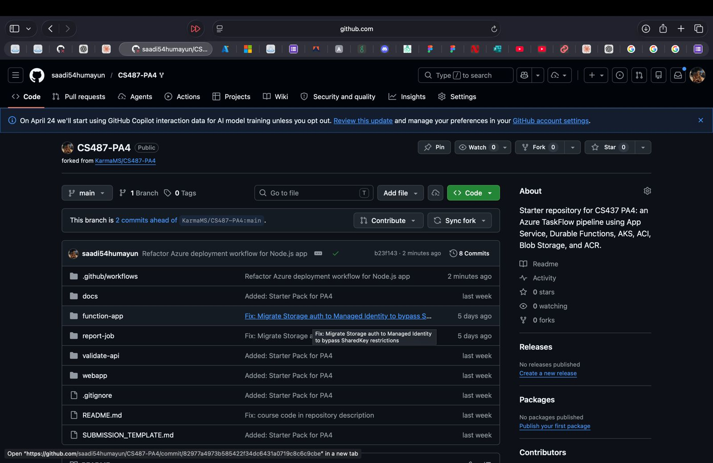

Description: TODO: Explain that this is your working fork and that it contains the PA4 starter structure.

This screenshot shows my forked GitHub repository containing the PA4 starter code. I am using this fork as my working repository to implement all tasks and track changes throughout the assignment.

### Evidence 1.2: App Service Overview

TODO: Embed screenshot of the Web App overview page showing `webapp-<rollnum>` and Running status.

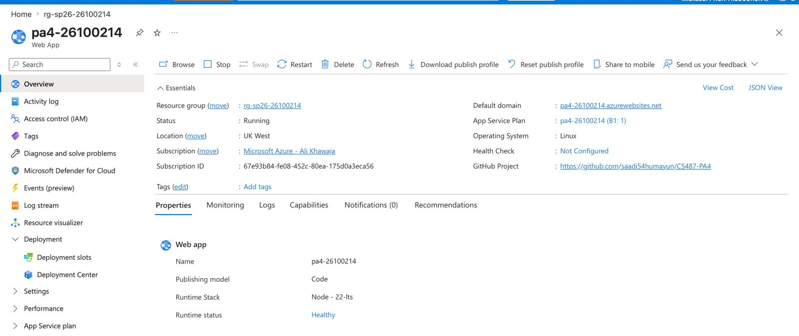

Description: TODO: State the resource group, region, runtime, and public URL.

This screenshot shows the Azure App Service named webapp-26100214 in a running state. It is deployed in resource group rg-sp26-26100214 and hosted in the ukwest region. The runtime stack is configured appropriately, and the public URL confirms that the web application is accessible over the internet.

### Evidence 1.3: Deployment Center / GitHub Actions

TODO: Embed screenshot of Deployment Center or the successful GitHub Actions deployment.

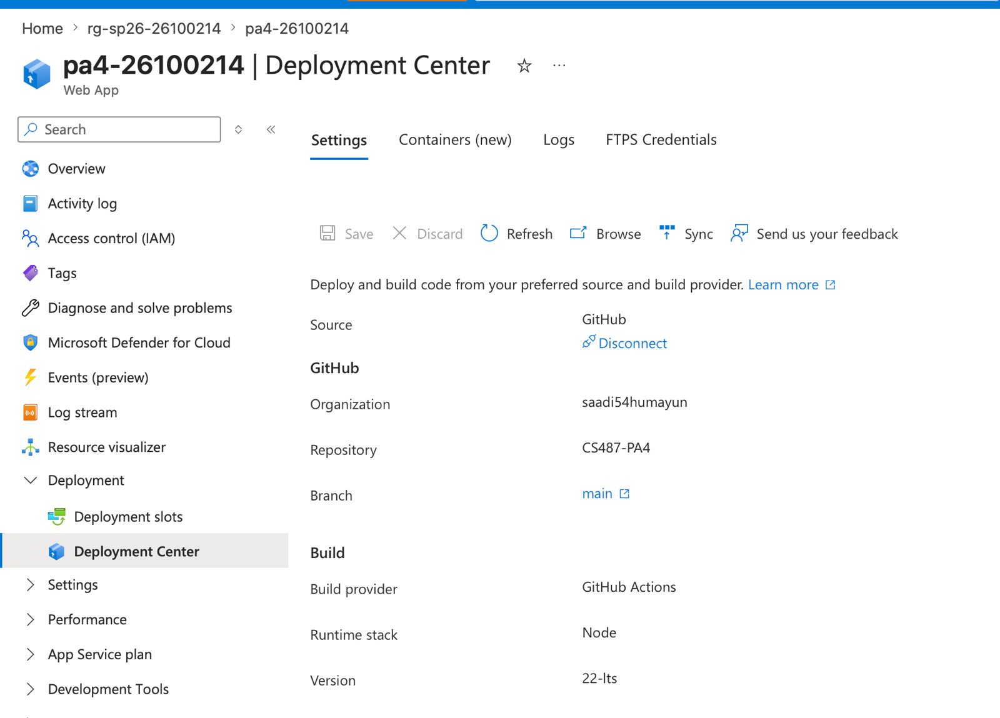

Description: TODO: Explain how the Web App is connected to your GitHub fork.

This screenshot demonstrates that the Web App is successfully connected to my GitHub fork via Deployment Center (or GitHub Actions). It shows that automatic deployments are configured, and code pushed to the repository is deployed to Azure without manual intervention.

### Evidence 1.4: Live Web UI

TODO: Embed screenshot of the TaskFlow page loaded in a browser.

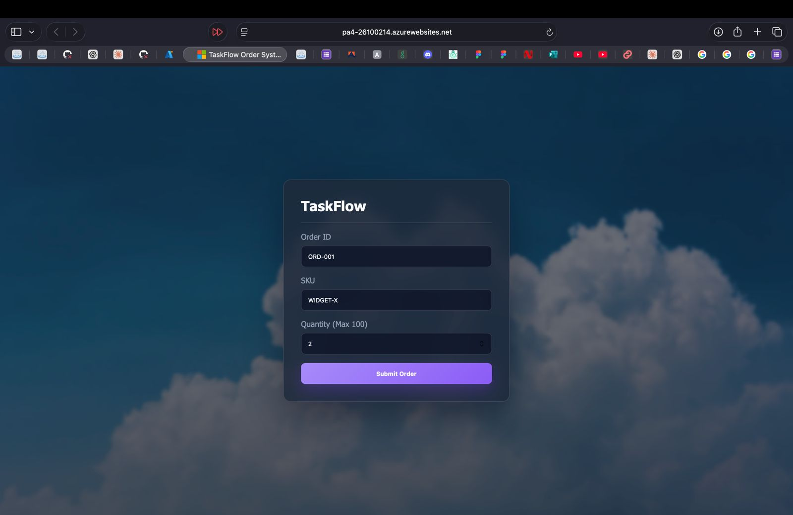

Description: TODO: Explain that the App Service is serving the frontend successfully.

This screenshot demonstrates that the Web App is successfully connected to my GitHub fork via Deployment Center (or GitHub Actions). It shows that automatic deployments are configured, and code pushed to the repository is deployed to Azure without manual intervention.

---

## Task 2: Azure Container Registry (15 points)

### Evidence 2.1: ACR Overview

TODO: Embed screenshot of `crpa4<rollnum>` overview.

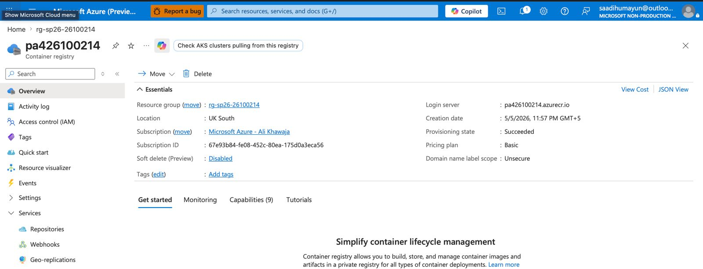

Description: TODO: Identify the registry SKU and resource group.

This screenshot shows my Azure Container Registry crpa426100214 deployed in the specified resource group. The registry SKU is configured (e.g., Basic), and it serves as a private container registry for storing Docker images used in this assignment.

### Evidence 2.2: Docker Builds

TODO: Embed screenshot showing successful local builds for `validate-api`, `report-job`, and `func-app`.

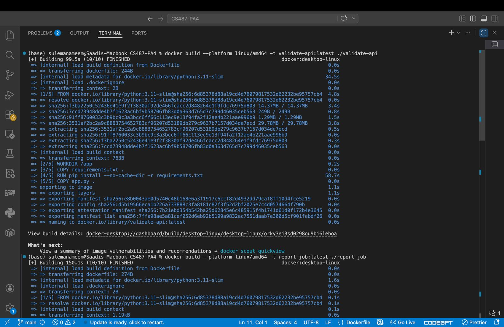

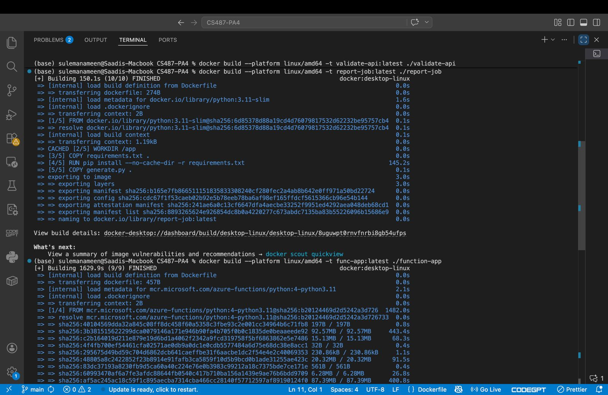

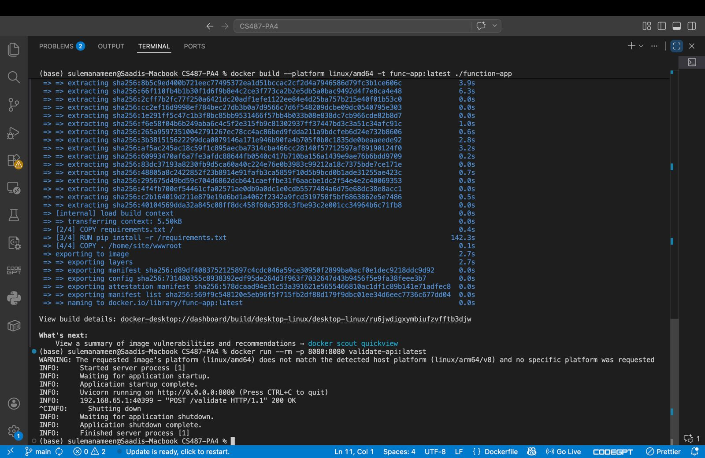

Description: TODO: Explain which folder produced each image.

validate-api is produced from the dockerfile inside the \validate-api
report-job is produced from the dockerfile inside the \report-job
func-app is produced from the dockerfile inside the \function-app

### Evidence 2.3: ACR Repositories

TODO: Embed screenshot or CLI output showing all three repositories in ACR.

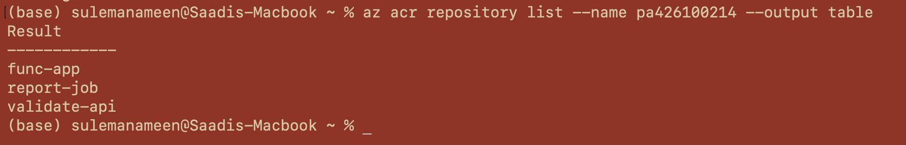

Description: TODO: Confirm `validate-api:v1`, `report-job:v1`, and `func-app:v1` were pushed.

This screenshot (or CLI output) confirms that all required images have been successfully pushed to Azure Container Registry and are available for deployment.

---

## Task 3: Durable Function Implementation (12 points)

### Evidence 3.1: Completed Function Code

TODO: Link to your completed file: `[function_app.py](function-app/function_app.py)`.

Description: TODO: Summarize how your orchestrator chains validation and report generation.

The implemented Durable Function orchestrator coordinates the workflow by first invoking the validation activity and then triggering the report generation activity. It ensures sequential execution, passing data between steps and handling failures appropriately.

### Evidence 3.2: Local Function Handler Listing

TODO: Embed screenshot of `func start` showing the HTTP starter, orchestrator, and activities.

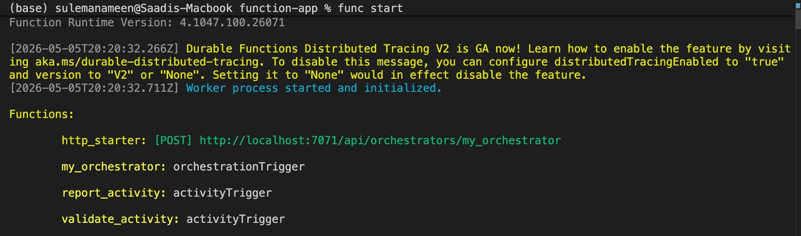

Description: TODO: Explain that the Durable Functions runtime discovered your handlers.

This screenshot shows the output of func start, where the Durable Functions runtime successfully discovers all defined handlers, including the HTTP starter, orchestrator, and activity functions. This confirms that the function app is correctly structured and runnable locally.

---

## Task 4: Function App Container Deployment (8 points)

### Evidence 4.1: Function App Container Configuration

TODO: Embed screenshot showing the Function App uses your `func-app:v1` image from ACR.

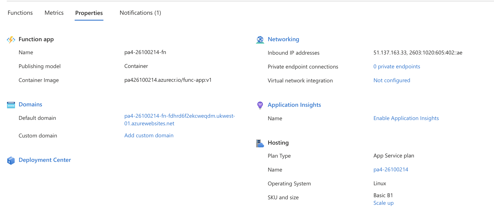

Description: TODO: State the Function App name and image URI.

- function app name - pa4-26100214-fn
image URI - 
- pa426100214.azurecr.io/func-app:v1

### Evidence 4.2: Orchestration Smoke Test

TODO: Embed screenshot of the `curl` output that starts an orchestration and returns status URLs.

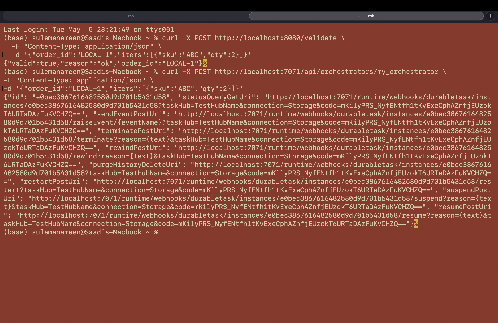

Description: TODO: Explain what the returned `id` and `statusQueryGetUri` prove.

### Evidence 4.3: Expected Failed Status Before Downstream Wiring

TODO: Embed screenshot of the status query JSON showing the expected failure before `VALIDATE_URL` is configured.

Description: TODO: Explain why this failure is expected at this stage.

---

## Task 5: AKS Validator (15 points)

### Evidence 5.1: AKS Cluster

TODO: Embed screenshot of AKS overview showing `aks-<rollnum>` succeeded.

Description: TODO: State node count, node size, region, and resource group.

### Evidence 5.2: Kubernetes Nodes and Pods

TODO: Embed screenshot of `kubectl get nodes` and `kubectl get pods`.

Description: TODO: Explain that the validator pod is scheduled and running.

### Evidence 5.3: Kubernetes Service

TODO: Embed screenshot of `kubectl get service validate-service`.

Description: TODO: Identify the external IP and port exposed by the LoadBalancer.

### Evidence 5.4: Validator API Tests

TODO: Embed screenshot of `curl /health`, a valid `curl /validate`, and an invalid `curl /validate`.

Description: TODO: Explain the accepted path and the `qty > 100` rejection rule.

### Evidence 5.5: Function App `VALIDATE_URL`

TODO: Embed screenshot showing the Function App application setting `VALIDATE_URL`.

Description: TODO: Explain how the Durable Function reaches the AKS validator.

### Evidence 5.6: AKS Idle Behavior

TODO: Embed AKS metrics screenshot and/or `kubectl` output after the service is idle.

Description: TODO: Explain that the AKS node remains running even when there are no orders.

---

## Task 6: ACI Report Job (15 points)

### Evidence 6.1: Blob Container

TODO: Embed screenshot of the `reports` blob container.

Description: TODO: Explain where generated PDFs are stored.

### Evidence 6.2: Manual ACI Run

TODO: Embed screenshot of `az container show` for `ci-report-test`.

Description: TODO: State the final container state and why the job exits.

### Evidence 6.3: ACI Logs

TODO: Embed screenshot of `az container logs`.

Description: TODO: Explain what the report job printed after generating and uploading the PDF.

### Evidence 6.4: Generated PDF

TODO: Embed screenshot showing `TEST-001.pdf` in Blob Storage or opened from Blob Storage.

Description: TODO: Explain how this proves the ACI wrote to storage.

### Evidence 6.5: Function App Managed Identity and IAM

TODO: Embed screenshots of system-assigned identity enabled and Contributor role assignment on your resource group.

Description: TODO: Explain why the Function App needs this permission to create ACIs.

### Evidence 6.6: Report App Settings

TODO: Embed screenshot of `REPORT_*`, `ACR_*`, `STORAGE_CONN`, and `SUBSCRIPTION_ID` settings.

Description: TODO: Explain what each group of settings is used for. Mask secrets.

---

## Task 7: End-to-End Pipeline (15 points)

### Evidence 7.1: Web App Wiring

TODO: Embed screenshot showing `FUNCTION_START_URL` and `FUNCTION_STATUS_URL` configured on the Web App.

Description: TODO: Explain how the frontend starts and polls the Durable orchestration.

### Evidence 7.2: Happy Path UI

TODO: Embed screenshots of the form before submit, Running status, and Completed status with report URL.

Description: TODO: Explain the valid order payload and final result.

### Evidence 7.3: Backend Participation

TODO: Embed screenshots showing Function App invocation, AKS validator evidence, ACI evidence, and Blob PDF evidence.

Description: TODO: Trace the same order ID across services.

### Evidence 7.4: Reject Path UI

TODO: Embed screenshot of an order with `qty > 100` being rejected.

Description: TODO: Explain why no report ACI should be created for this order.

---

## Task 8: Write-up and Architecture Diagram (5 points)

### Evidence 8.1: Architecture Diagram

TODO: Embed your architecture diagram from `docs/`.

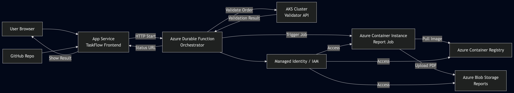

Description: TODO: Confirm that it shows GitHub, App Service, Durable Function, AKS, ACI, Blob Storage, ACR, and IAM.

This architecture diagram shows the complete TaskFlow pipeline. The user interacts with the frontend hosted on App Service, which triggers a Durable Function orchestrator. The orchestrator first sends the request to the AKS-hosted validator service. If valid, it triggers an ACI container to generate a report, which pulls its image from ACR and stores the output in Blob Storage. Managed Identity (IAM) is used to securely allow the Function App to access ACI, ACR, and storage resources.

### Question 8.2: Service Selection

TODO: In 3-4 sentences each, explain why TaskFlow uses App Service, Durable Functions, AKS, and ACI for their specific roles.
 
- App Service is used to host the TaskFlow frontend because it provides a fully managed platform for deploying web applications with minimal configuration. It integrates easily with GitHub for continuous deployment and automatically handles scaling, availability, and HTTPS. This makes it ideal for serving the user interface reliably without managing infrastructure. Additionally, it allows quick updates whenever code is pushed to the repository.

- Durable Functions are used to orchestrate the workflow between validation and report generation because they support stateful, long-running processes. They manage execution order, retries, and state persistence automatically. This eliminates the need to manually track workflow progress or handle failures between steps. It is especially useful for chaining multiple dependent operations in a reliable way.

- AKS is used to host the validator service because it is designed for long-running, scalable microservices. It allows fine-grained control over deployments, scaling, and networking. Since the validator is expected to be always available to handle incoming requests, AKS provides a stable and persistent environment. It also supports load balancing and container orchestration for production-level services.

- ACI is used for the report generation job because it is a short-lived, on-demand workload. It allows containers to run without managing servers and automatically shuts down after completing the task. This makes it cost-efficient for batch jobs like PDF generation. It is ideal when the workload does not need to run continuously.

### Question 8.3: ACI vs AKS

TODO: Compare idle behavior, cost behavior, and operational model for AKS and ACI using your screenshots.

ACI and AKS differ significantly in how they behave when idle, their cost model, and operational complexity. In AKS, the cluster nodes remain running even when there is no workload, which results in continuous cost but ensures the service is always ready. In contrast, ACI runs containers only when triggered and stops after completion, meaning there is no cost during idle periods.

From an operational perspective, AKS requires managing clusters, nodes, deployments, and scaling policies, making it more complex but powerful for long-running services. ACI, on the other hand, is serverless and requires minimal configuration, making it much simpler to use. Therefore, AKS is suitable for persistent services like the validator, while ACI is better for short-lived jobs like report generation.

### Question 8.4: Durable Functions vs Plain HTTP

TODO: Explain at least two problems that Durable Functions solves for this sequential workflow.

Durable Functions solve several problems that would arise with a plain HTTP-based workflow. First, they provide built-in state management, allowing the system to track progress across multiple steps without manually storing intermediate results. In a plain HTTP approach, the developer would need to implement custom logic to manage state and handle failures.

Second, Durable Functions support reliable execution with automatic retries and fault handling. If a step like validation or report generation fails, the orchestrator can retry or handle the error gracefully. In contrast, plain HTTP calls would require manual retry mechanisms and error handling, making the system more complex and less reliable.

### Question 8.5: Cost Review

TODO: Embed Cost Management screenshot scoped to your resource group.

Description: TODO: Identify the most expensive resource and explain why.

### Question 8.6: Challenges Faced

TODO: Describe at least two real issues you hit and how you debugged them.

One major issue I faced was in Task 4 (Function App container deployment) where the orchestration endpoint was not working through curl. Initially, everything seemed correct as the functions were visible in the Azure portal and the container was deployed successfully. However, when I tried to trigger the orchestration using the HTTP endpoint, it did not respond as expected.

Later, the issue became more confusing because the functions that were previously visible in the Function App overview completely disappeared. Despite rebuilding the Docker image, pushing it again to ACR, and redeploying, the functions were still not being detected. This indicated that the problem was not just with the endpoint, but with how Azure was loading the function metadata inside the container.

To debug this, I tried multiple solutions:

* Rebuilding the Docker image with --platform linux/amd64 to resolve architecture mismatch warnings
* Verifying that the function code exists inside the container
* Checking logs using docker logs and Azure log stream to identify startup errors
* Ensuring that required environment variables like AzureWebJobsStorage were correctly set
* Restarting the Function App and redeploying the container multiple times

Despite these efforts, the issue persisted, which suggests it could be an Azure-specific deployment or caching issue, where the platform fails to correctly load or refresh function metadata from the container image.

---
